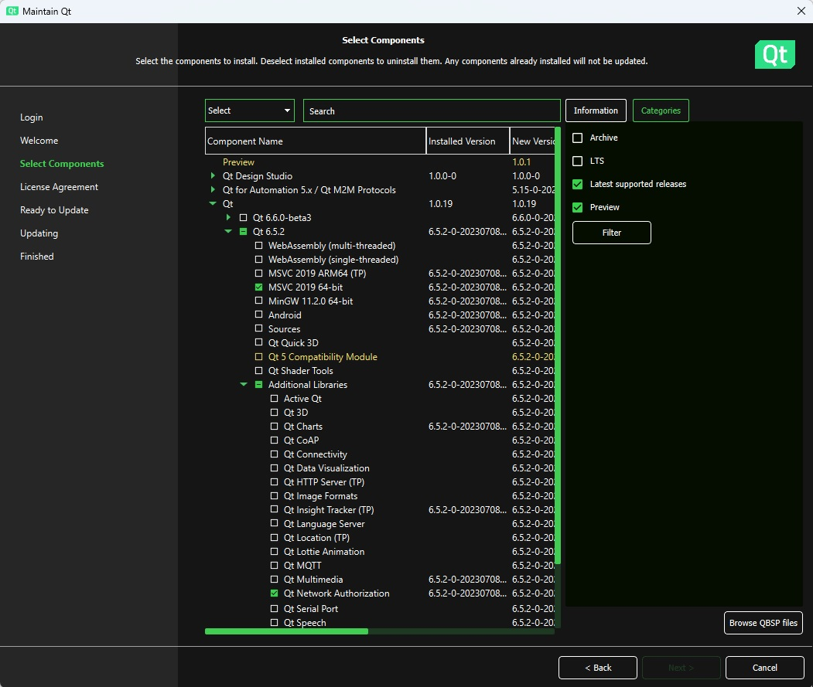

# BananaSharePoint-USI
R&amp;D project to create a Qt App that works with files on Teams or sharepoint.

##  Description
This is a R&amp;D project.

The objective is to create a small desktop application that reads and writes text files, with the capabilities to connect directly in Teams or sharepoint.

## Tasks

Be able to setup the environment to build the CMake project under the folder "TextEditor".

Authenticate to MS Sharepoint / Teams.

- Read/write files in the personal space of a Teams user.
- Read/write files in a Teams channel
- Read files from personal spaces as Administrator.

## Tools

- c++ compiler
- MS Teams
- [Qt for Open Source development](https://www.qt.io/download-open-source)  
  The required component is Qt 6.5.2 (the base related to your OS).  
  Qt Network Authorization is optional.  
  
